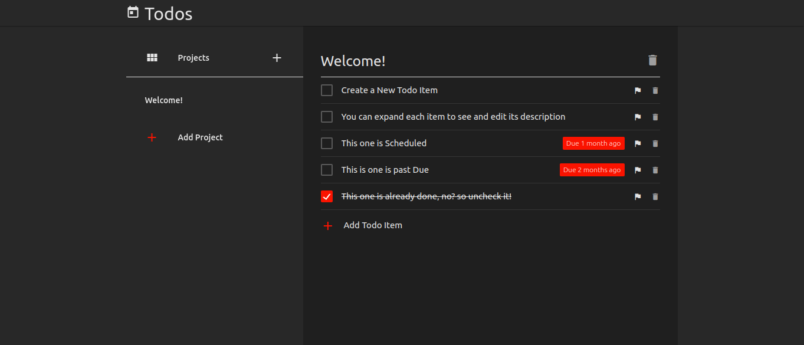

<h1 align="center">Welcome to Todo List 👋</h1>
<p>
  
  <a href="https://github.com/ebukaume/todo-list#readme" target="_blank">
    
  </a>
  <a href="https://github.com/ebukaume/todo-list/graphs/commit-activity" target="_blank">
    
  </a>
  <a href="https://github.com/ebukaume/todo-list/blob/master/LICENSE" target="_blank">
    
  </a>
  <a href="https://twitter.com/ebukaume" target="_blank">
    
  </a>
  <a href="https://twitter.com/ArNazeh" target="_blank">
    
  </a>
</p>
<br>

<p>
  <a href="https://bookstore-react-redux.herokuapp.com" target="_blank">
    
  </a>
</p>

<br>

This project is part of a series of projects to be completed by students of [Microverse](https://www.microverse.org/ 'The Global School for Remote Software Developers!').

This is Todo List app helps you manage your todos in an efficient way. Every `todo` belongs to a `project`, so that way you can easily manage related todos. You can create, edit or delete a project. However, you can only create, edit or mark a todo as completed.

The full project requirements can be found [here](https://www.theodinproject.com/courses/javascript/lessons/todo-list).

## Built With

- JavaScript (ES6)
- HMTL
- SCSS
- npm
- webpack

### ✨ [Live Demo](https://github.com/ebukaume/todo-list)

## Usage

> Clone the repository to your local machine

```sh
$ git clone https://github.com/ebukaume/todo-list.git
```

> cd into the directory, install dependencies, build and start

```sh
$ cd todo-list
$ npm install
$ npm run build
$ npm run start
```

> Open `http://127.0.0.1:8080` using your favourite broswer, if it doesn't open automatically.

## Authors

👤 **Ebuka Umeokonkwo**

- Github: [@ebukaume](https://github.com/ebukaume)
- Twitter: [@ebukaume](https://twitter.com/ebukaume)

👤 **Ar Nazeh**

- Github: [@nazeh](https://github.com/Nazeh)
- Twitter: [@ArNazeh](https://twitter.com/ArNazeh)

## 🤝 Contributing

Contributions, issues and feature requests are welcome!<br />Feel free to check [issues page](https://github.com/ebukaume/todo-list/issues).

1. Fork it (https://github.com/ebukaume/todo-list/fork)
2. Create your working branch (git checkout -b [choose-a-name])
3. Commit your changes (git commit -am 'what this commit will fix/add/improve')
4. Push to the branch (git push origin [chosen-name])
5. Create a new Pull Request

## Show your support

Give a ⭐️ if you like this project!

## 📝 License

This project is [MIT](https://github.com/ebukaume/todo-list/blob/master/LICENSE) licensed.

## Contact me

I am looking for my next opportunity. Reach out to me if you are looking to hire!
_ebukaume@gmail.com_